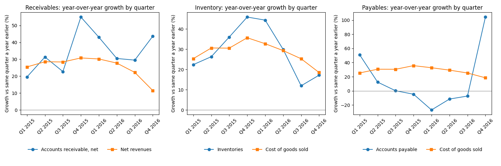

**Measures** (USD millions; gaps in percentage points)

| Measure | FY2013 | FY2014 | FY2015 | FY2016 | Q4 2015 | Q4 2016 |
|---|---|---|---|---|---|---|
| Days sales outstanding | 32.9 | 33.1 | 39.9 | 47.2 | 34.1 | 43.9 |
| Days inventory | 143.2 | 124.6 | 138.9 | 129.9 | 118.3 | 117.0 |
| Days payable | 50.5 | 48.8 | 35.6 | 58.0 | 30.3 | 52.2 |
| Receivables growth minus revenue growth | | +1.0 | +26.5 | +21.9 | +24.2 | +32.1 |
| Inventory growth minus cost-of-sales growth | | -17.1 | +15.0 | -8.4 | +10.2 | -1.3 |
| Payables growth minus cost-of-sales growth | | -4.4 | -35.6 | +78.7 | -40.4 | +85.8 |
| Allowance for doubtful accounts | | 3.7 | 5.9 | 11.3 | | |
| ... % of gross receivables | | 1.05% | 1.10% | 1.45% | | |
| ... % of revenue | | 0.12% | 0.15% | 0.23% | | |
| Reserves for returns, allowances, markdowns and discounts | | 68.9 | 94.5 | 146.2 | | |
| ... % of gross receivables | | 19.6% | 17.7% | 18.7% | | |
| ... % of revenue | | 2.23% | 2.38% | 3.03% | | |

Q4 2014, for the same-quarter comparison: 28.8 days sales outstanding, 110.0 days inventory, 43.1 days payable. Days use 365 (366 for FY2016) and 92 for Q4. Blank cells are not in the documents.

**Basis**

- **Revised figures:** the spreadsheet is as originally reported. Its Revisions sheet lists no change to revenue, cost of goods sold, receivables, inventory or payables. FY2016 revenue (4,825.3) is after a revision from the January 2017 earnings release (4,828.2). Q4 income statement figures are derived by subtraction (About sheet).
- **Acquisitions:** Endomondo (January 2015) and MyFitnessPal (March 2015) are digital businesses. "Other assets acquired" totalled 19.9 (FY2015 report, p. 55), against a 153.8 rise in receivables that year, so they do not explain the 2015 jumps. None in 2016.
- **Gross receivables:** "Accounts receivable, net" plus the two reserves above, which the company says "are recorded as an offset to accounts receivable" (FY2016 report, p. 41). The notes do not separate non-customer receivables, so days are on the whole balance. The cost line is "Cost of goods sold"; no substitute.

**Flags**

| Flag | Evidence | Where to look | Innocent reading | Concerning reading |
|---|---|---|---|---|
| **1. Receivables outgrowing revenue two years running** | BS quarterly "Accounts receivable, net" up 43.6% at Q4 2016; IS quarterly "Net revenues" up 11.5%. Q4 days: 28.8, 34.1, 43.9 (2014 to 2016). Fiscal-year days: 33.1, 39.9, 47.2. | FY2016 report, p. 37: "primarily due to the timing of shipments and a higher proportion of sales to our international customers with longer payment terms". FY2015 report, p. 33: "primarily due to the timing of shipments." | Shipments landed late in the quarter and more sales went to international customers on longer terms, so more of the quarter's sales were still uncollected at year end. | Timing is the explanation in both years, while Q4 revenue growth slowed to 11.5%. Sales may have shipped ahead of demand or on extended terms. Check early 2017 collections, returns and terms. |
| **2. Payables doubled at year end** | BS quarterly "Accounts payable" 409.7 against 200.5, up 104.3%, after four quarters of declines; "Cost of goods sold" up 18.5%. Q4 days 52.2 against 30.3. CF annual "Accounts payable" added 202.4 of 304.5 operating cash flow. | FY2016 report, p. 37: "primarily due to the timing of inventory payments as well as significant increases in inventory in-transit in the current period". Product purchase obligations, p. 39: 684.5, against 1,537.9 (FY2015 report, p. 36). | FY2015 payables were unusually low (35.6 days, against 48.8 and 50.5 in the two years before), so part of this restores the norm. Goods in transit add payables before they sell. | Paying suppliers later lifts operating cash flow once, then reverses. Inventory rose only 17.2% and purchase commitments fell 55.5%, which needs reconciling with "significant increases in inventory in-transit". |
| **3. Customer reserves rising faster than sales** | Returns, allowances, markdowns and discounts reserve 146.2 against 94.5, up 54.7%; revenue up 21.7%. Share of revenue: 2.23%, 2.38%, 3.03% (2014 to 2016). Doubtful-accounts allowance 11.3 against 5.9. | FY2016 report, p. 41 and p. 55 (balances); p. 31: "$15.2 million in bad debt expense"; p. 29: "a $2.9 million adjustment related to a return credit for footwear". FY2015 report, p. 37 (Sports Authority receivable, $32.5 million). | A harder retail year brings more returns, markdowns and discounts, and the company reserved for them. Reserves stayed between 17.7% and 19.6% of gross receivables. The customer failure is named and expensed. | Reserves are estimates. The FY2015 allowance was 5.9 beside a 32.5 exposure; 15.2 was expensed the next year. A return credit surfaced after the earnings release. Check whether year-end reserves proved sufficient. |

On the Sports Authority receivable, the FY2015 report (p. 37) said: "we do not currently believe that the exposure to our receivables as of December 31, 2015 is materially impacted". On Q4 2016, the FY2016 report (p. 27) says: "our growth was challenged due to the disruption of the North American retail environment".

**Also out of line**

- Inventory in FY2015: up 45.9% against cost of goods sold up 30.9%, and still +11.7 points ahead at Q1 2016, before reversing to -13.4 points at Q3 2016. FY2015 report, p. 33: "early deliveries of product to meet key seasonal floor set dates, as well as strategic investments in auto-replenishment products".
- Q1 2016 days sales outstanding: 49.2, against 44.3 and 46.5 in Q1 2015 and Q1 2014.
- Q4 gross margin (IS quarterly, "Gross profit" over "Net revenues"): 44.7% in 2016, against 48.0% and 49.9%. The FY2016 report (p. 30) cites "increased liquidation and discounting".
- Largest North America customer's share of receivables fell: 23.4%, 18.7%, 16% at the 2014, 2015 and 2016 year ends (FY2015 report, p. 49; FY2016 report, p. 54), so the growth in receivables came from other customers.
- Outside these accounts: in Q4 2016, "as a change in estimate, we reversed $48.0 million of incentive compensation accruals" (FY2016 report, p. 36).

**Not calculated**

Reserves by quarter and for FY2013, the split between customer and other receivables, and the inventory reserve balance: none is in the attached documents (only a tax-effected "Inventory obsolescence reserves" line appears, FY2016 report, p. 67).
